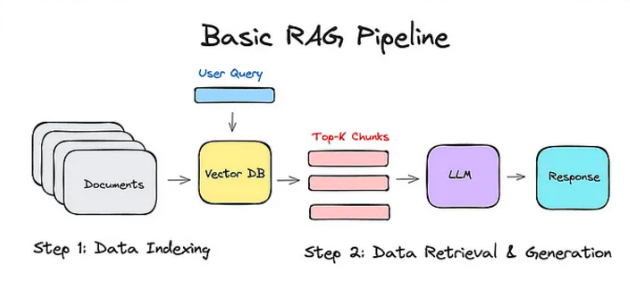

# Rag-Mistral-Assignmentt
RAG (Retrievel Augmented Generation) implementation using ChromaDB, Mistral-7B-Instruct-v0.1, GPT-4-All / All-MiniLM-L6-v2 Embedding and different retriever methods like MultiQueryRetriever, Fiass, BM25 and ensemble (fiass/bm25 using equal and different weights)

